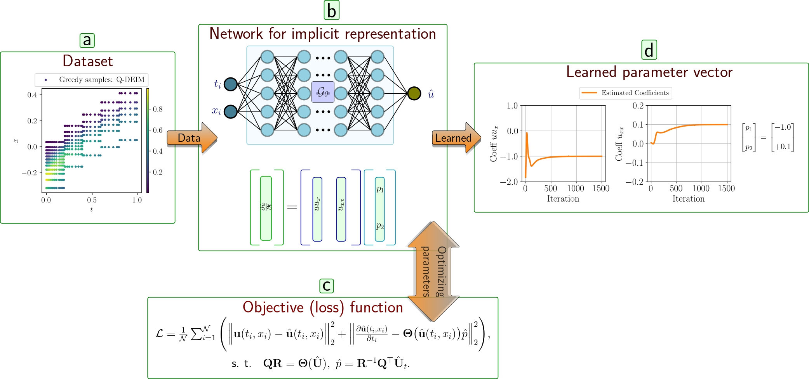

# GS-PINN: Greedy Sampling for Parameter Estimation in Partial Differential Equations

__GS-PINN__ is a greedy sampling approach for Partial Differential Equation (PDE) parameter estimation. __GS-PINN__ makes use of __Q-DEIM__ algorithm to choose the most informative samples from snapshot matrix of a PDE. Greedy samples are used to train a physics-informed neural network architecture which maps the nonlinear relation between spatio-temporal data and the measured values. 

Through various simulation examples we have shown that greedy sampling approach based on __Q-DEIM__ algorithm significantly outperforms common random sampling method for the PDE parameter estimation both in required training time for the PINN architecture as well as relative estimation error. Our investigation revealed that by using time domain division of the snapshot matrix of a PDE and __Q-DEIM__ algorithm
we can capture local dynamics, hence acquire more valuable samples which improves the quality of parameter estimation via PINN. Leveraging __Q-DEIM__ and PINN we have estimated the corresponding
parameters of three well known PDEs, (i) Allen-Cahn equation, (ii) Burgers’ equation, and (iii)
Korteweg-de Vries equation with 0.383%, 1.39%, and 0.28% of the dataset, respectively.





## Installation
I assume that you already have `linux` OS to create a new `conda` environemnt.
 
To install the packge open a new `bash` terminal in your local directory and type

```bash
conda env create -f environment.yml
```

This will create a conda environment with the default name `PINN_DEIM`.

To activate the conda environment type on the `bash` terminal 

```bash
conda activate PINN_DEIM
```
A `Spyder` IDE is already installed together with the environment. When your conda environment is activated type `Spyder` so you can use it.

__hint__: the root folder should be named `PINN_DEIM` so you can execute the modules. In case you download the repository and extract it in your local machine you have to consider this! Nevertheless, the root directory is `PINN_DEIM` and different modules are imported e.g. `from PINN_DEIM.Functions.modules import Siren`

If you `do not want to use conda` you can create a virtual environment based on `requirements.txt` as explained in the following.

```bash
python -m venv <env_name>
virtualenv <env_name>
```

Activate the virtual environment based on your operating system:

• On Windows:

```bash 
.\<env_name>\Scripts\activate
```

• On linux or MacOS:

```bash 
source <env_name>/bin/activate
```
      
Once the virtual environment is activated, use pip to install the dependencies listed in the requirements.txt file:

```bash
pip install -r requirements.txt
```

In the case of having truble to install the packages you can do it manually as follows:

after creating a new virtual environment by using `python -m venv PINN_DEIM` then activate it as mentioned above then install the packages as follows

```bash
pip3 install torch torchvision torchaudio --index-url https://download.pytorch.org/whl/cu118

pip install numpy==1.23.5
pip install scipy==1.11.4
pip install matplotlib==3.5.3
pip install tqdm==4.65.0
pip install fastapi==0.96.1
pip install scikit-learn==1.0.2
pip install pandas pandas==1.5.2
pip install --upgrade transformers
```


## Usage

In the __Examples__ folder you can find different simulations. We considered 3 PDEs `Allen-Cahn`, `Korteweg-de Vries`, and `Burgers'`. In the __data__ folder you will find the dataset that are used in the article. In the __Functions__ folder you can find different modules that are used in the package.

### Allen-Cahn Equation

To re-generate figures `2` and `3` related to `Allen-Cahn` PDE run `AC_DEIM_sampling.py`


To re-generate figures `4`and `5` related to `Allen-Cahn` PDE run `plotting_AC_tol_time_div_sensitivity.py`


### Burgers' Equation

To re-generate figures `6` and `7` related to `Burgers'` PDE run `Burger_DEIM_sampling.py`


To re-generate figures `8` and `9` related to `Burgers'` PDE run `plotting_Burger_tol_time_div_sensitivity.py`


### Korteweg-de Vries equation

To re-generate figures `10` and `11` related to `Korteweg-de Vries equation` PDE run `KDV_DEIM_sampling.py`


To re-generate figure `12` and `13` related to `Korteweg-de Vries equation` PDE run `plotting_KDV_tol_time_div_sensitivity.py`


### Some notes related to figure 5, 9, 13 for Allen-Cahn, Burgers’ and Korteweg-de Vries equation
I add some notes here for Allen-Cahn PDE, but the same applys for Korteweg-de Vries and Burgers’ equations.

Re-generating the figure `5` takes a few hours, since it is the comparison of `random-sampling` and `greedy-sampling. Therefore we saved the simulation data in a folder to avoid tedious re-simulation. The following paragraph is for the situation that you are interested in generating data from the begining.

To compare the `random sampling` with `greedy sampling` results you should first run the `AC_data_generation.py`. This module has two seperate parts that produce the simulation data by training the PINN architecture with `random sampling` and `DEIM sampling`. It saves the data in the `path` that is mentioned at the end of the module. Having the data you can run the module `plotting_AC_tol_time_div_sensitivity.py` to produce `figure 5`.

To re-generate the `figure 9` related to `Burgers'` you should first run `Burger_data_generation.py` to generate the data then run the `plotting_Burger_tol_time_div_sensitivity.py`.

To re-generate the `figure 13` related to `Korteweg-de Vries` you should first run `KDV_data_generation.py` to generate the data then run the `plotting_KDV_tol_time_div_sensitivity.py`.

##### hint: if you use `CPU` for the simulation you may have an issue the data that is generated via `GPU`! e.g. if you try to run `plotting_AC_tol_time_div_sensitivity.py` you might get an error regarding `GPU`! since the data that were save in the path had been generated via a `GPU`, to solve this issue you need to re-generate the data via `CPU` and then use them! so first one should run `AC_data_generation.py` then run `plotting_AC_tol_time_div_sensitivity.py`.


## Extra modules

This repository contains extra simulation examples for PDE parameter estimation based on domain decomposition and ensembling methods. For farther details you can consider the following paper [XPINN](https://github.com/AmeyaJagtap/XPINNs). To run the simulations related to `ensempling + domain decomposition` you can run  `ensemble_xpinn_AC_DEIM_sampling.py` which is based on `Q-DEIM` method or `ensemble_xpinn_AC_random_dampling.py` which is based on random sampling. For the `Korteweg-de Vries` you can run `ensemble_xpinn_KDV_DEIM_sampling.py` which is based on `Q-DEIM + ensembling + domain decomposition`. Modules like `xpinn_entiredomain_AC_DEIM_comparison.py`, or `xpinn_entiredomain_Burger_DEIM_comparison.py`, and `xpinn_entiredomain_KDV_DEIM_comparison.py` are only for `Q-DEIM + domain decomposition` and there is no ensembling approach.


## Contributing

Feel free to clone the repository and extend.


## Where to find us?

Max Planck Institute for Dynamics of Compelx Technical Systems, CSC group, Magdeburg, 39106, Germany.
You can either drop an email to the authors.

Email Me: (forootani@mpi-magdeburg.mpg.de/alifoootani@ieee.org)

Email Me: (kapadia@mpi-magdeburg.mpg.de)

Email Me: (chellappa@mpi-magdeburg.mpg.de)

Email Me:(goyalp@mpi-magdeburg.mpg.de)

Email Me: (benner@mpi-magdeburg.mpg.de)


## License

[MIT](https://choosealicense.com/licenses/mit/)